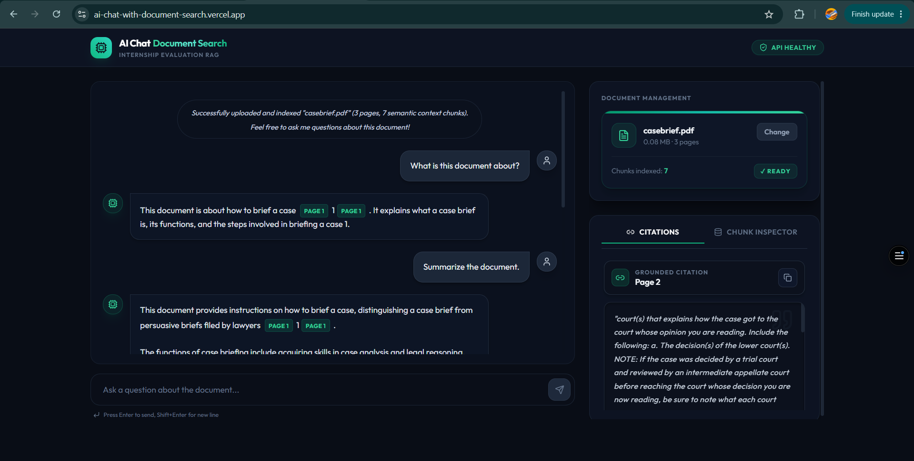
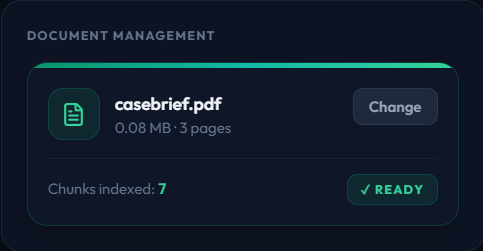
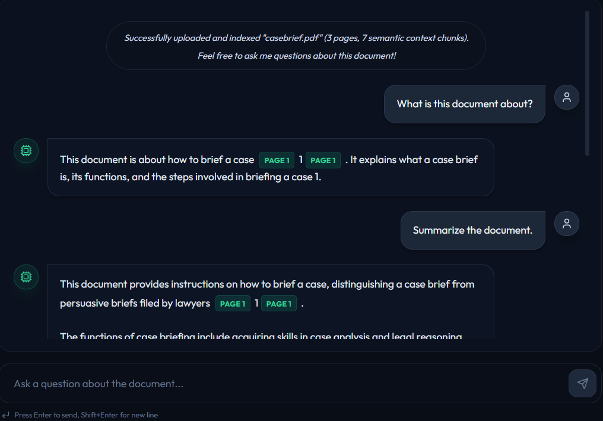
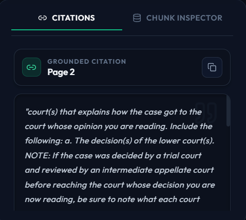
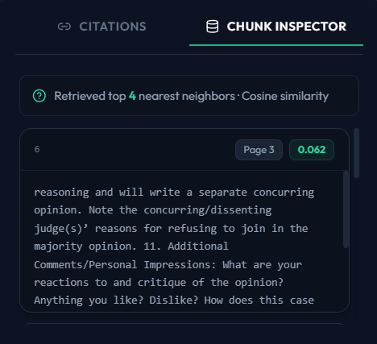

# AI Chat with Document Search

A full-stack Retrieval-Augmented Generation (RAG) application that allows users to upload PDF documents and conduct grounded, citation-backed conversations against their content. The backend ingests PDFs page-by-page, generates 384-dimensional vector embeddings using a locally-run `all-MiniLM-L6-v2` model, stores them in a persistent ChromaDB collection, and retrieves semantically relevant chunks at query time. Retrieved context is injected into a structured system prompt before being sent to the Gemini API, ensuring all generated answers are grounded in the document and every factual claim is tied to a specific source page.

**Live Application**

| Service | URL |
|---|---|
| Frontend | https://ai-chat-with-document-search.vercel.app |
| Backend | https://ai-chat-with-document-search-production.up.railway.app |
| Health Endpoint | https://ai-chat-with-document-search-production.up.railway.app/api/v1/health |
| API Documentation | https://ai-chat-with-document-search-production.up.railway.app/docs |

---

## Features

- PDF upload and ingestion via multipart form upload
- Page-by-page text extraction using `pdfplumber`
- Page-aware recursive character text chunking (chunk size 1000, overlap 200)
- Local embedding generation using `sentence-transformers/all-MiniLM-L6-v2` (384 dimensions)
- Vector storage and cosine similarity search using ChromaDB with persistent on-disk storage
- Document-scoped similarity queries using ChromaDB metadata filtering by `document_id`
- Grounded answer generation using Gemini 2.5 Flash with temperature 0.1
- Automatic fallback to Gemini 2.0 Flash on 503/UNAVAILABLE errors
- Structured `[Page X]` citation extraction via regex post-processing
- Citation viewer panel for inspecting source context text
- Chunk inspector panel showing retrieved vector chunks and cosine similarity scores
- Real-time system health diagnostics (ChromaDB, embedding model, Gemini API)
- Conversational memory: full chat history sent per request for multi-turn context
- Hallucination prevention enforced by system prompt constraints
- Responsive React 19 frontend with TailwindCSS
- Deployment on Railway (backend) and Vercel (frontend)

---

## System Architecture

### Ingestion Pipeline

```
PDF Upload (multipart/form-data)
        |
        v
PDF Parsing (pdfplumber, page-by-page)
        |
        v
Recursive Character Text Chunking
(chunk_size=1000, overlap=200, per-page boundary)
        |
        v
Batch Embedding Generation
(sentence-transformers/all-MiniLM-L6-v2, 384-dim vectors)
        |
        v
ChromaDB Upsert
(PersistentClient, cosine space, document_id metadata filter)
```

### Query and Generation Pipeline

```
User Query (POST /api/v1/chat)
        |
        v
Query Embedding
(all-MiniLM-L6-v2, single-vector encode)
        |
        v
ChromaDB Similarity Search
(top-4 nearest neighbors, cosine distance, filtered by document_id)
        |
        v
Context Block Assembly
(RAGPromptOrchestrator formats chunks as [Source page: N] blocks)
        |
        v
System Prompt Injection
(system_prompt.txt template with {context} substitution)
        |
        v
Gemini API Call
(gemini-2.5-flash, temperature=0.1, max_output_tokens=1024)
        |
        v
Citation Resolution
(regex parse [Page X] tags, map back to retrieved chunk text)
        |
        v
Response Serialization
(answer + citations[] + retrieved_chunks[])
```

---

## Tech Stack

### Frontend

| Technology | Version | Role |
|---|---|---|
| React | ^19.2.6 | UI framework |
| Vite | ^8.0.12 | Build tool and dev server |
| TailwindCSS | ^3.4.19 | Utility-first styling |
| Lucide React | ^1.17.0 | Icon library |
| React Context API | built-in | Global state management |

### Backend

| Technology | Version | Role |
|---|---|---|
| FastAPI | >=0.110.0,<1.0.0 | HTTP API framework |
| Uvicorn | >=0.28.0,<1.0.0 | ASGI server |
| Pydantic v2 | >=2.6.0,<3.0.0 | Request/response validation and schemas |
| pydantic-settings | >=2.2.0,<3.0.0 | Environment variable management |
| pdfplumber | >=0.11.0,<1.0.0 | PDF text extraction |
| python-multipart | >=0.0.9,<1.0.0 | Multipart file upload parsing |
| httpx | >=0.27.0,<1.0.0 | HTTP client |
| Python | 3.11.9 | Runtime |

### AI / RAG Stack

| Technology | Version | Role |
|---|---|---|
| google-genai SDK | >=1.0.0,<3.0.0 | Gemini API client |
| Gemini 2.5 Flash | — | Primary LLM for answer generation |
| Gemini 2.0 Flash | — | Fallback LLM on 503 errors |
| sentence-transformers | >=3.0.0,<4.0.0 | Local embedding model runner |
| all-MiniLM-L6-v2 | — | 384-dimensional sentence embedding model |
| torch | >=2.4.0,<3.0.0 | PyTorch backend for sentence-transformers |
| transformers | >=4.45.0,<5.0.0 | HuggingFace model backbone |
| ChromaDB | >=0.5.0,<2.0.0 | Vector database with on-disk persistence |

---

## Project Structure

```
AI_Chat_with_Document_Search/
├── backend/
│   ├── app/
│   │   ├── main.py                  # FastAPI app init, lifespan, CORS, router mount
│   │   ├── api/
│   │   │   └── v1/
│   │   │       ├── router.py        # Aggregate router: health + documents + chat
│   │   │       └── endpoints/
│   │   │           ├── health.py    # GET /api/v1/health
│   │   │           ├── document.py  # POST /api/v1/documents/upload
│   │   │           └── chat.py      # POST /api/v1/chat
│   │   ├── core/
│   │   │   └── config.py            # Pydantic Settings: env vars, CORS, model names
│   │   ├── models/
│   │   │   └── schemas.py           # Pydantic request/response schema definitions
│   │   ├── prompts/
│   │   │   ├── system_prompt.txt    # Externalized system prompt template with {context}
│   │   │   └── rag_prompt.py        # RAGPromptOrchestrator: loads, caches, formats prompt
│   │   └── services/
│   │       ├── pdf_parser.py        # PDFParserService: pdfplumber page-by-page extraction
│   │       ├── text_splitter.py     # RecursiveCharacterTextSplitter: custom implementation
│   │       ├── embedding_engine.py  # EmbeddingEngine: singleton, all-MiniLM-L6-v2
│   │       ├── vector_store.py      # VectorStoreService: ChromaDB client, upsert, query, delete
│   │       ├── retrieval_service.py # RetrievalService: embed query + similarity search
│   │       ├── generation_service.py # GenerationService: prompt format + Gemini call + citation parse
│   │       └── gemini_client.py     # GeminiClient: google.genai SDK, fallback logic
│   ├── tests/
│   │   └── test_rag.py              # Pytest test suite
│   ├── requirements.txt             # Pinned dependency matrix
│   ├── runtime.txt                  # python-3.11.9 (Railway/Render runtime pin)
│   └── .env.example                 # Environment variable template
├── frontend/
│   ├── src/
│   │   ├── main.jsx                 # React 19 entry point
│   │   ├── App.jsx                  # Root component with AppProvider
│   │   ├── context/
│   │   │   └── AppContext.jsx       # Global state: upload, chat, citations, chunks
│   │   ├── hooks/
│   │   │   └── useRAG.js            # useRAG hook: accesses AppContext
│   │   ├── services/
│   │   │   └── api.js               # API client: checkHealth, uploadDocument, sendMessage
│   │   └── components/
│   │       ├── Layout.jsx           # Two-column layout: chat left, sidebar right
│   │       ├── chat/
│   │       │   ├── ChatContainer.jsx  # Message list with loading indicator
│   │       │   ├── ChatMessage.jsx    # Message bubble: citation buttons, list formatting
│   │       │   └── MessageInput.jsx   # Query input with send action
│   │       ├── sidebar/
│   │       │   ├── CitationViewer.jsx # Citation panel: source text, Show More/Less
│   │       │   └── ChunkInspector.jsx # Chunk panel: vector scores, text excerpts
│   │       └── upload/
│   │           └── UploadZone.jsx     # Drag-and-drop PDF upload with progress
│   ├── .env.example                   # VITE_API_BASE_URL template
│   └── package.json
├── .gitignore
└── README.md
```

---

## Backend Workflow

### 1. Upload Endpoint — `POST /api/v1/documents/upload`

The `document.py` endpoint receives a multipart PDF upload, validates the file extension, reads the raw bytes, and rejects empty or zero-byte files.

### 2. PDF Parsing — `PDFParserService`

`pdfplumber` opens the PDF from in-memory bytes and extracts text from each page. Lines are stripped and rejoined to normalize whitespace. Empty pages produce an empty string entry rather than being silently dropped, preserving page numbering integrity for citation accuracy.

### 3. Text Chunking — `RecursiveCharacterTextSplitter`

A custom implementation of recursive character splitting (not LangChain). It splits text using a priority separator list `["\n\n", "\n", " ", ""]`, recursing to finer separators when a segment exceeds the chunk size (1000 characters). An overlap of 200 characters is preserved between adjacent chunks by rewinding the buffer, maintaining cross-boundary context. Chunking happens per-page so that `page_number` is embedded in each chunk's metadata.

### 4. Embedding Generation — `EmbeddingEngine`

A singleton that loads `all-MiniLM-L6-v2` via `sentence-transformers` on first instantiation. The model is pre-loaded during application startup via FastAPI's `lifespan` context manager to avoid cold-start latency on the first request. `get_embeddings()` batch-encodes all chunks at once and returns a list of 384-dimensional float vectors.

### 5. ChromaDB Persistence — `VectorStoreService`

`chromadb.PersistentClient` is initialized at the configured `CHROMA_PERSIST_DIR` path. A single collection named `pdf_documents` is created with `hnsw:space=cosine` to enable cosine distance computation. Each chunk is upserted with its embedding, raw text, and metadata fields: `document_id`, `file_name`, `page_number`, and `chunk_index`. The `document_id` (UUID) is a client-generated identifier used to scope all queries to a single document.

### 6. Retrieval — `RetrievalService`

At query time, the user's question is embedded using the same `all-MiniLM-L6-v2` singleton. `VectorStoreService.query_similarity()` queries ChromaDB for the top-4 nearest neighbors using a metadata filter `{"document_id": document_id}`, ensuring retrieval is scoped to the active document. ChromaDB returns cosine distances; these are converted to similarity scores with `score = 1.0 - distance` and sorted descending.

### 7. Prompt Grounding — `RAGPromptOrchestrator`

`rag_prompt.py` loads `system_prompt.txt` from disk and caches it as a template string. At generation time, each retrieved chunk is formatted as a labeled block:

```
---
[Source page: N]
<chunk text>
---
```

These blocks are joined and substituted into the `{context}` placeholder of the system prompt template.

### 8. Gemini Generation — `GeminiClient`

The `google.genai` SDK (v2 client pattern) sends the formatted system instruction, full conversation history, and current query to `gemini-2.5-flash` at temperature 0.1. If the primary model returns a 503 or UNAVAILABLE error, the client automatically retries with `gemini-2.0-flash`. Responses exceeding 1024 output tokens are truncated by the API.

### 9. Citation Resolution — `GenerationService._resolve_citations_from_text()`

The raw answer text is scanned with the regex `\[Page\s*(\d+(?:\s*,\s*\d+)*)\]` to extract all page references. Each referenced page is matched back against the retrieved chunks. If matching chunks exist, their text is concatenated with ` ... ` as a separator to form the citation source text. This produces a structured `citations[]` array in the response.

### 10. Response Serialization

The endpoint returns a `ChatAnswerResponse` containing:
- `answer`: the raw Gemini response text with inline `[Page X]` tags
- `citations[]`: resolved source text snippets per page
- `retrieved_chunks[]`: the raw top-4 retrieval results with scores, for the chunk inspector panel

---

## Retrieval Pipeline

1. **Query embedding**: the user query string is encoded by `EmbeddingEngine.get_query_embedding()` to a 384-dimensional vector using the same model used during ingestion. This ensures the query and document embeddings share the same vector space.

2. **Similarity search**: `VectorStoreService.query_similarity()` issues a ChromaDB `collection.query()` call with `n_results=4` and a `where` filter on `document_id`. ChromaDB uses HNSW (Hierarchical Navigable Small World) indexing for approximate nearest neighbor search in cosine space.

3. **Score conversion**: ChromaDB returns cosine distance values (range 0–2). These are converted to similarity with `score = round(1.0 - distance, 4)`, where a score closer to 1.0 indicates higher semantic similarity.

4. **Result ordering**: results are sorted by similarity score descending before being passed to the generation layer.

5. **Context construction**: the top-4 chunks are formatted as labeled source blocks by `RAGPromptOrchestrator.get_system_prompt()` and injected into the system prompt before the Gemini API call.

---

## Citation System

**Page tracking**: during chunking, each chunk carries its `page_number` from the PDF parser. This is stored in ChromaDB metadata and returned with every retrieval result.

**Citation extraction**: after Gemini generates an answer, `GenerationService._resolve_citations_from_text()` applies a regex to find all `[Page X]` and `[Page X, Page Y]` references in the response text.

**Citation mapping**: each referenced page number is matched against the set of retrieved chunks. Matching chunks from the same page are concatenated to produce a `citation.text` field representing the grounding source.

**Citation viewer**: the frontend `CitationViewer.jsx` component displays the citation source text when a user clicks any `[Page X]` button inline in the chat. Text longer than 150 characters is previewed with a Show More / Show Less toggle. The full text is preserved internally and copied entirely by the copy button.

**Grounding verification**: every citation traces back to an actual retrieved chunk. If a page is referenced in the answer but not present in the top-4 retrieved chunks, the citation text is set to `"[Grounding text not found in local context cache]"` rather than silently omitting it.

---

## API Endpoints

| Method | Endpoint | Description |
|---|---|---|
| `GET` | `/` | Root welcome message with links to docs and health |
| `GET` | `/api/v1/health` | Health check: ChromaDB, embedding model, Gemini API status |
| `POST` | `/api/v1/documents/upload` | PDF ingestion: parse, chunk, embed, store in ChromaDB |
| `POST` | `/api/v1/chat` | RAG chat: retrieve, ground, generate, resolve citations |

### Request / Response Schemas

**`POST /api/v1/documents/upload`**

Request: `multipart/form-data` with field `file` (PDF only)

```json
{
  "status": "success",
  "document_id": "3f7a2c1d-...",
  "file_name": "contract.pdf",
  "file_size_bytes": 204800,
  "total_pages": 12,
  "total_chunks": 47,
  "created_at": "2024-01-15T10:30:00Z"
}
```

**`POST /api/v1/chat`**

```json
{
  "message": "What are the payment terms?",
  "document_id": "3f7a2c1d-...",
  "history": [
    { "role": "user", "content": "previous question" },
    { "role": "model", "content": "previous answer" }
  ]
}
```

```json
{
  "answer": "Payment is due within 30 days of invoice [Page 4].",
  "citations": [
    {
      "citation_id": "cite_1",
      "page": 4,
      "text": "All invoices are due and payable within thirty (30) days..."
    }
  ],
  "retrieved_chunks": [
    {
      "chunk_id": "3f7a2c1d-..._chunk_12",
      "score": 0.8741,
      "page": 4,
      "text": "All invoices are due and payable within thirty (30) days..."
    }
  ]
}
```

**`GET /api/v1/health`**

```json
{
  "status": "healthy",
  "timestamp": "2024-01-15T10:30:00Z",
  "services": {
    "chroma_db": "connected",
    "embedding_model": "loaded",
    "gemini_api": "available"
  }
}
```

---

## Environment Variables

### Backend (`backend/.env`)

| Variable | Description | Required | Default |
|---|---|---|---|
| `GEMINI_API_KEY` | Google AI Studio API key | Yes | — |
| `GEMINI_MODEL` | Primary Gemini model identifier | No | `gemini-2.5-flash` |
| `GEMINI_FALLBACK_MODEL` | Fallback model used on 503 errors | No | `gemini-2.0-flash` |
| `CHROMA_PERSIST_DIR` | Filesystem path for ChromaDB on-disk storage | No | `data/chroma` |
| `CORS_ORIGINS` | Comma-separated allowed origins or JSON array | No | `*` |

### Frontend (`frontend/.env`)

| Variable | Description | Required | Default |
|---|---|---|---|
| `VITE_API_BASE_URL` | Backend API base URL | No | `http://localhost:8000/api/v1` |

---

## Local Development Setup

### Prerequisites

- Python 3.11.x
- Node.js 18+
- A Gemini API key from [Google AI Studio](https://aistudio.google.com/)

### Backend

```bash
# 1. Navigate to the backend directory
cd backend

# 2. Create and activate a virtual environment
python -m venv venv
venv\Scripts\activate        # Windows
# source venv/bin/activate   # macOS / Linux

# 3. Install dependencies
pip install -r requirements.txt

# 4. Configure environment variables
cp .env.example .env
# Edit .env and set GEMINI_API_KEY

# 5. Start the development server
uvicorn app.main:app --reload
```

The API will be available at `http://localhost:8000`. Interactive documentation is at `http://localhost:8000/docs`.

### Frontend

```bash
# 1. Navigate to the frontend directory
cd frontend

# 2. Install dependencies
npm install

# 3. Configure environment variables
cp .env.example .env
# Edit .env and set VITE_API_BASE_URL=http://localhost:8000/api/v1

# 4. Start the development server
npm run dev
```

The frontend will be available at `http://localhost:5173`.

---

## Running the Project

Run both services in separate terminals:

**Terminal 1 — Backend:**
```bash
cd backend
venv\Scripts\activate
uvicorn app.main:app --reload
```

**Terminal 2 — Frontend:**
```bash
cd frontend
npm run dev
```

---

## Example Usage

```
1. Open http://localhost:5173 in a browser.

2. Upload a PDF using the drag-and-drop zone or file browser.
   The backend parses, chunks, embeds, and stores the document.
   The UI confirms: "Successfully uploaded and indexed <filename> (N pages, N chunks)."

3. Type a question in the chat input.
   The backend retrieves the top-4 most semantically relevant chunks
   and generates a grounded answer with [Page X] citations.

4. Click any [Page X] citation button in the chat message.
   The Citation Viewer panel opens and displays the exact source text
   from that page as it was retrieved from ChromaDB.

5. Switch to the Chunk Inspector tab.
   Inspect the raw retrieved chunks, their cosine similarity scores,
   and source page numbers for each query.
```

---

## Hallucination Protection

Hallucination prevention is enforced at the prompt level. The system prompt in `system_prompt.txt` includes explicit constraints:

1. The model is instructed to answer using **only** the provided context blocks.
2. If the answer is not present in the retrieved context, the model must respond with the exact phrase: `"I cannot find the answer in the uploaded document."`
3. The model is prohibited from inventing facts, names, dates, organizations, or legal conclusions not present in the context.
4. Partial answers are required when information is only partially available.

The model is configured at temperature 0.1, which minimizes creative generation and keeps responses close to the grounding context.

**Example:**

> **Question:** "What is the CEO's favorite food?"
>
> **Response:** "I cannot find the answer in the uploaded document."

This response is produced because no retrieved context block contains information about a CEO's food preferences. The model does not speculate, infer from training data, or produce a plausible-sounding but fabricated answer.

---

## Deployment

### Backend Deployment (Railway)

The backend is deployed on [Railway](https://railway.app).

**Build command:**
```
pip install -r requirements.txt
```

**Start command:**
```
uvicorn app.main:app --host 0.0.0.0 --port $PORT
```

**Required environment variables on Railway:**

| Variable | Value |
|---|---|
| `GEMINI_API_KEY` | Your Google AI Studio key |
| `GEMINI_MODEL` | `gemini-2.5-flash` |
| `GEMINI_FALLBACK_MODEL` | `gemini-2.0-flash` |
| `CHROMA_PERSIST_DIR` | `data/chroma` |
| `CORS_ORIGINS` | `https://ai-chat-with-document-search.vercel.app` |

The `runtime.txt` file in the backend directory pins the Python version to `3.11.9` for Railway's buildpack.

> **Note:** Railway's ephemeral filesystem means the ChromaDB persistence directory does not survive redeployments unless a persistent volume is attached. For production use, attach a Railway volume at the `CHROMA_PERSIST_DIR` path.

### Frontend Deployment (Vercel)

The frontend is deployed on [Vercel](https://vercel.com).

**Build command:** `npm run build`

**Output directory:** `dist`

**Required environment variable on Vercel:**

| Variable | Value |
|---|---|
| `VITE_API_BASE_URL` | `https://ai-chat-with-document-search-production.up.railway.app/api/v1` |

---

## Screenshots

### Home Screen



### PDF Upload



### Chat Interface


### Citation Viewer


### Chunk Inspector


---

## Future Improvements

- **Hybrid search**: combine dense vector similarity with BM25 keyword search for improved recall on exact-match queries
- **Re-ranking**: apply a cross-encoder re-ranker pass on top-k retrieved candidates before grounding the prompt
- **Streaming responses**: stream Gemini output tokens to the frontend for lower perceived latency
- **Multi-document support**: allow multiple documents to be indexed simultaneously with per-session scoping
- **Authentication**: add user accounts and session isolation so each user manages their own document set
- **Citation highlighting**: highlight the exact sentence within source text that corresponds to the cited claim
- **Persistent conversation memory**: persist chat history to a database for returning users

---

## Engineering Notes

**Why ChromaDB?**
ChromaDB provides a self-contained, embeddable vector database with on-disk persistence that requires no external infrastructure. For a single-service deployment, it avoids the operational overhead of managed vector stores (Pinecone, Weaviate) while still supporting HNSW indexing and metadata filtering. The `document_id` filter in every query ensures retrieval is scoped to the active document without requiring collection-per-document overhead.

**Why `all-MiniLM-L6-v2`?**
This model produces 384-dimensional sentence embeddings and runs efficiently on CPU. It was trained specifically for semantic textual similarity tasks using a distillation approach from larger models. For document question-answering, it consistently captures paragraph-level semantic meaning without requiring GPU acceleration, which makes it practical for CPU-only deployment environments like Railway's free tier.

**Why page-aware chunking?**
PDF documents have inherent page boundaries that correspond to logical sections in physical documents (contracts, reports, textbooks). Chunking per-page rather than across page boundaries preserves citation accuracy: a chunk's `page_number` metadata accurately reflects where in the PDF the content appears. If chunking were done across page boundaries, citation page numbers would be ambiguous.

**Why recursive character splitting?**
The recursive splitter attempts to split on natural language boundaries first (`\n\n` for paragraphs, then `\n` for lines, then space for words) before resorting to hard character slicing. This preserves coherent semantic units within each chunk, which improves embedding quality and retrieval precision compared to fixed-window slicing.

**Why grounded prompting?**
The system prompt explicitly scopes the model to the retrieved context and requires it to cite sources. Without this constraint, Gemini would combine retrieved context with parametric knowledge from pretraining, making it impossible to distinguish document-grounded facts from hallucinated ones. Low temperature (0.1) further suppresses creative variation.

**Why citation resolution by regex post-processing?**
Structured output from the Gemini API (function calling / JSON mode) would be more robust but adds latency and complexity. Regex post-processing on the raw text response is simpler, stateless, and tolerates minor format variations in the model's output (e.g., `[Page 4, 5]` vs `[Page 4, Page 5]`). The citation mapping step cross-references extracted page numbers against retrieved chunks so every citation is verifiable.

**Why React + FastAPI?**
FastAPI provides async request handling, automatic OpenAPI documentation, Pydantic v2 validation, and a clean dependency injection pattern. React with the Context API provides a straightforward global state model for a single-page application without requiring Redux or external state management. Both stack well with Vercel and Railway's respective deployment models.

---

## Evaluation Highlights

This project demonstrates applied RAG competency across the full pipeline:

| Competency | Implementation |
|---|---|
| **Embedding pipeline** | Local `all-MiniLM-L6-v2` via `sentence-transformers`, singleton pattern, batch and single-query encoding |
| **Vector database** | ChromaDB with HNSW cosine space, metadata-filtered per-document queries, on-disk persistence |
| **Semantic retrieval** | Query embedding + top-K similarity search, cosine distance to similarity conversion, sorted results |
| **Prompt orchestration** | Externalized system prompt template, `RAGPromptOrchestrator` singleton, `[Source page: N]` labeled context blocks |
| **Grounded generation** | Temperature 0.1, system-prompt-enforced context restriction, exact refusal phrase for missing information |
| **Citation generation** | Regex parsing of `[Page X]` markers, mapping to retrieved chunk text, structured citation response schema |
| **Hallucination mitigation** | Prompt-level constraints, low temperature, no parametric knowledge permitted in responses |
| **Full-stack integration** | FastAPI backend, React 19 frontend, shared JSON schema contract, deployed on Railway + Vercel |
| **Production practices** | Pydantic v2 schemas, structured logging, lifespan model pre-loading, fallback model on 503, `.gitignore`, `.env.example` |
